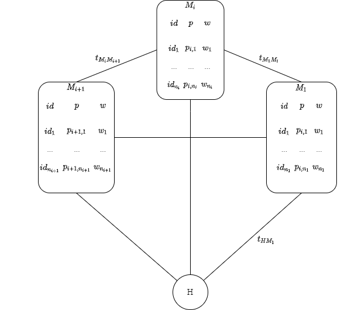

# Алгоритм поиска минимального пути для покупки товаров по наименьшей стоимости как пример метода решения Thief Orienteering Problem

Ключевые слова: процесс закупки товаров, алгоритм поиска минимального пути, Thief Orienteering Problem.

## Аннотация
В статье выполнен обзор существующих подходов к процессу закупки товаров в магазине по приложениям для отслеживания скидок, произведен сравнительный анализ найденных приложений по следующим критериям: учет расстояния до местоположения пользователя при предложении товаров, возможность составления списка покупок, возможность поиска товара по его названию или по категориям, возможность построения маршрута по выбранным магазинам. В результате анализа было установлено, что в существующих решениях отсутствует возможность построения маршрута по выбранным магазинам. На основе этого были сформулированы требования к алгоритму построения минимального пути для закупок товаров. Была описана математическая модель процесса закупки товаров на основе алгоритма поиска минимального пути с ограничениями по времени и стоимости как вариации задачи Thief Orienteering Problem (ThOP). Так как алгоритм является вариацией задачи ThOP, были рассмотрены три эвристических подхода к решению ThOP: генетический алгоритм со случайным смещенным ключом, итерированный локальный поиск, муравьиный алгоритм. В результате сравнения было выявлено, что наиболее подходящим для решения задачи ThOP является муравьиный алгоритм. На основе этого к рассматриваемому в данной работе алгоритму построения маршрута для закупки товаров были предъявлены дополнительные требования.

## Введение
В современном мире существует большое количество магазинов с разной ценовой политикой, наличием/отсутствием акций и скидок, из-за чего стоимость одних и тех же товаров может различаться, поэтому человеку, экономящему свои денежные средства, бывает непросто определиться с выбором магазина. Существуют приложения, позволяющие отследить текущие цены на товары в разных магазинах (например, “Едадил” [1], “Акции всех магазинов России” [3], “СкидоПоиск: скидки и акции” [4]), но они всё ещё отнимают время, так как пользователю нужно просмотреть все варианты для каждого товара и определиться с выбором одного или нескольких магазинов, учесть их удаленность от дома и друг от друга. Алгоритм, позволяющий находить кратчайший путь для покупки товаров с ограничениями по времени и стоимости, снизит временные затраты на выбор нужного маршрута и сократит количество денежных расходов.

Объектом исследования является модель процесса закупки товаров в магазине, предметом – скорость и денежные затраты закупки товаров.

Целью статьи является описание алгоритма, позволяющего находить кратчайший маршрут для покупки товаров по минимальной стоимости и критериев для его оценки.

Для достижения поставленной цели необходимо решить следующие задачи:
1. Обзор подходов к решению проблемы закупок товаров в магазине;
2. Описание математической модели процесса закупки товаров на основе алгоритма поиска минимального пути с ограничениями по времени и стоимости как вариации задачи Thief Orienteering Problem [11];
3. Изучение и сравнение существующих алгоритмов поиска минимального пути для решения Thief Orienteering Problem;
4. Описание разрабатываемого алгоритма поиска минимального пути для покупки товаров и критериев для его оценки.

## Обзор предметной области
### Принцип отбора аналогов
Для формирования требований к описываемому алгоритму построения кратчайшего маршрута для покупки товаров по наименьшей стоимости были рассмотрены существующие приложения для поиска скидок для закупки товаров в магазине. Для анализа были рассмотрены наиболее популярные по оценкам пользователей в App Store агрегаторы скидок. 

Поиск аналогов производился в магазине App Store путем ввода в строку поиска “Скидки и акции в магазинах”. Выборка среди найденных приложений осуществлялась по рейтингу среди похожий приложений. Информация о функциях приложений собиралась эмпирическим путем после установки каждого из приложений на смартфон.

#### 1. Приложение “Едадил” 
Приложение “Едадил” [1] - приложение с каталогом скидок на продукты и другие товары повседневного спроса в магазинах. Чтобы узнать о предложениях на конкретный товар, нужно ввести его название в строку поиска или найти его в подходящей категории, также для этого можно отсканировать штрихкод на упаковке. Найденные на товар предложения нельзя отсортировать по удаленности магазина от пользователя. Есть возможность посмотреть все магазины на карте, в том числе ближайшие к пользователю, выбрать нужный и просмотреть его каталог скидок. В приложении можно создать список покупок в каждом магазине с учетом всех скидок. Построить маршрут по выбранным магазинам нельзя. 

#### 2. Приложение “SkidkaOnline”
Приложение “SkidkaOnline” [2] содержит скидки на товары в магазинах. Чтобы узнать о предложениях на конкретный товар, нужно ввести его название в строку поиска или найти его в подходящей категории. Найденные на товар предложения нельзя отсортировать по удаленности магазина от пользователя. Есть возможность посмотреть список ближайших магазинов, выбрать нужный и открыть его на карте. Также сервис предоставляет возможность оставлять и читать отзывы от других пользователей, оценивать товары. В приложении нет возможности составить список покупок и построить маршрут по выбранным магазинам.

####  3. Приложение “Птичка”
Приложение “Птичка” [3] - приложение с каталогом скидок на продукты и другие товары повседневного спроса в магазинах. Чтобы узнать о предложениях на конкретный товар, нужно ввести его название в строку поиска или найти его в подходящей категории. Найденные на товар предложения можно отфильтровать по удаленности магазина от пользователя. Есть возможность посмотреть список ближайших магазинов, выбрать нужный и открыть его на карте. В приложении можно создать список покупок в каждом магазине с учетом всех скидок. Построить маршрут по выбранным магазинам нельзя.

#### 4. Приложение “СкидкоПоиск”
Приложение “СкидкоПоиск” [4] позволяет отслеживать скидки на продукты и другие товары повседневного спроса, добавленные пользователем в список товаров. Добавление товаров в список возможно только с помощью сканирования штрихкода товара. Также есть возможность сравнивать цены. Приложение не запрашивает геопозицию пользователя, но предлагает выбрать город из списка. Построить маршрут по выбранным магазинам нельзя.

#### 5. Приложение “Прошопер”
Приложение “Прошопер” [5] - приложение с каталогом скидок на продукты и другие товары повседневного спроса в магазинах. Есть возможность искать и просматривать товары, но составлять список покупок или добавлять товары в избранное – нет. Приложение не запрашивает геопозицию пользователя, но предлагает выбрать город из списка. Построить маршрут по выбранным магазинам нельзя.

### Критерии сравнения аналогов
Для сравнения вышеописанных аналогов были выбраны следующие критерии:

#### Учет расстояния до местоположения пользователя при предложении товаров
Учет расстояния до местоположения пользователя при предложении товаров позволит пользователю просматривать сначала те товары, которые находятся ближе всего к нему. Так пользователь будет тратить меньше времени на выбор товара, а также ему не придётся каждый раз проверять расстояние до магазина. 

#### Возможность составления списка покупок 
Список покупок – список товаров, которые пользователь планирует приобрести в магазине. Список покупок в приложении подразумевает такой список, в котором товары сгруппированы по магазинам, в которых пользователь их планирует приобрести. Можно отмечать купленные товары и при этом они не будут удалены из списка. 

Наличие “списка покупок” дает пользователю возможность фиксировать необходимые для покупки товары, чтобы ничего не забыть. Возможность отмечать купленные товары способствует тому, что пользователю не нужно каждый раз просматривать список полностью.

#### Возможность поиска товара по его названию или по категориям
Если в приложении поиск товара осуществляется только с помощью сканирования штрихкода товара, это может вызвать трудности, так как у пользователя может не быть товара, на который он хочет найти скидки. В случае возможности поиска товара по его названию или по категориям, пользователю не нужен штрихкод товара.   

#### Возможность построения маршрута по выбранным магазинам
Реализованная в приложении возможность построения маршрута по выбранным магазинам помогает пользователю в планировании похода по магазинам и может сэкономить время. 

### Таблица сравнения по критериям
Сравнение аналогов по критериям представлено в таблице 1. Соответствие критерию в таблице обозначается символов "+", несоответствие - "-".

Таблица 1 – Сравнение аналогов по критериям
| Критерий/Аналог           | Учет расстояния до местоположения пользователя при предложении товаров | Возможность составления списка покупок | Возможность поиска товара по его названию или по категориям |
|---------------------------|------------------------------------------------------------------------|----------------------------------------|-------------------------------------------------------------|
| Приложение “Едадил”       | -                                                                      | +                                      | +                                                           |
| Приложение “SkidkaOnline” | -                                                                      | -                                      | +                                                           |
| Приложение “Птичка”       | +                                                                      | +                                      | +                                                           |
| Приложение “СкидкоПоиск”  | -                                                                      | +                                      | -                                                           |
| Приложение “Прошопер”     | -                                                                      | -                                      | +                                                           |

### Выводы по итогам сравнения
Анализируя данные, представленные в таблице 1, можно сделать вывод, что по выбранным критериям лучшим приложением является приложение “Птичка”, однако у него отсутствует возможность построения маршрута по выбранным магазинам. 

Приложение “Едадил” уступает приложению “Птичка” только в учете расстояния до местоположения пользователя при предложении товаров по скидке. Остальные приложения имеют лишь по одному критерию.

Ни один из рассмотренных аналог не предоставляет возможность построения маршрута по выбранным магазинам. Нахождение кратчайшего маршрута за указанное пользователем время также поможет сэкономить время. 

Таким образом, для устранения недостатков вышеописанных аналогов необходима разработка алгоритма построения кратчайшего маршрута для закупок товаров, требования к которому будут описаны в следующем разделе.

## Выбор метода решения
В результате обзора аналогов был сделан вывод о том, что существующие подходы к процессу закупки товаров в магазине по приложениям для отслеживания скидок обладают общим недостатком, который заключается в отсутствии возможности построения маршрута по выбранным магазинам в приложении. Также не во всех аналогах есть возможность составления списка покупок, поиска товаров по их названию, учет расстояния до местоположения пользователя при предложении товаров. Исходя из этого были определены требования к разрабатываемому алгоритму, которые необходимо соблюдать для покрытия всех критериев:
1. Должно учитываться местоположение пользователя, чтобы алгоритм мог выбрать ближайшие к пользователю магазины;
2. Необходим список покупок, который будет подаваться на вход алгоритму для поиска нужных товаров;
3. При составлении списка покупок у пользователя должна быть возможность ввести наименование товаров, при вводе наименования должна всплывать подсказка возможного товара;
4. Алгоритм строит кратчайший маршрут по выбранным магазинам за указанное пользователем время. Если решения за заданное время не существует, берется значение по умолчанию, которое является минимально возможным. 

С целью дальнейшего описания алгоритма поиска кратчайшего маршрута для закупок товаров и наложения на него дополнительных требований, в следующем разделе будет описана математическая модель процесса закупки товаров, а также переход решения к решению задачи ThOP.

## Описание метода решения
### Описание математической модели
Математическая модель процесса закупки товаров в магазинах на основе алгоритма поиска минимального пути с ограничениями по времени и стоимости как вариации задачи Thief Orienteering Problem представлена на рис. 1.
|  |
|:------------------------------------------------:|
|         *Рисунок 1 - Математическая модель*      | 

Начальная и конечная точки совпадают и являются изначальным местоположением пользователя (узел H). 

Узлы представляют собой магазины и содержат в себе информацию о товарах: $id$ – номер товара, $w$ – вес товара, $p$ – стоимость товара в конкретном магазине. Всего в магазине $n_i$ штук товаров, где $i$ – номер магазина. Поиск минимального пути будет осуществляться между начальной и конечной точкой по выбранным магазинам.

Пусть $v_{min}$ и $v_{max}$ обозначают минимальную и максимальную скорость человека, когда его сумка вместимости $W$ соответственно полна или пуста. Скорость $v$ человека с сумкой весом $w, 0 ≤ w ≤ W$, определяется выражением $v=v_{max}-w \cdot (v_{max}-v_{min})/W$.  Значение $(v_{max}-v_{min})/W$ является постоянным. 

Время пути между каждой парой точек рассчитывается каждый раз следующим образом: $t_{M_iM_{i+1}}=S_{M_iM_{i+1}}/v$.
	
### Изучение и сравнение существующих алгоритмов поиска минимального пути для решения Thief Orienteering Problem
Thief Orienteering Problem (далее ThOP) – многокомпонентная задача, которая объединяет в себе две классические комбинаторные задачи: задачу ориентирования (OP) [6] и задачу о рюкзаке (KP) [7]. В этой задаче человек, называемый вором, несет вместительный рюкзак и имеет ограничение по времени на сбор предметов, распределенных по городам. Вор имеет фиксированные начальную и конечную точки, начинает свое путешествие с пустым рюкзаком и движется со скоростью, обратно пропорциональной весу рюкзака. Пока есть время, вор может посещать города и собирать предметы. Цель задачи — определить маршрут вора и предметы, которые нужно собрать, чтобы максимизировать прибыль рюкзака.

Далее рассмотрены три эвристических подхода к решению ThOP. 
 
#### 1. Генетический алгоритм со случайным смещенным ключом (BRKGA)
Генетический алгоритм со случайным смещенным ключом [8] – метаэвристический алгоритм, основанный на теории эволюции. Для решения задачи ThOP сначала составляется случайная популяция, где каждая особь представлена в виде вектора из $m$ случайных ключей, где $m$ – общее количество доступных предметов в городах. В каждой популяции особи делятся на две одинаковые по размерам группы: с лучшим и худшим решением. Новая популяция строится следующим образом: добавляется группа с лучшим решением, добавляются мутационные особи для поддержаний видового разнообразия, а также добавляется оставшаяся часть особей путем равномерного кроссовера, в котором каждая особь получается из случайно выбранных двух особей из групп особей с лучшим и худшим решением. Данный процесс повторяется до тех пор, пока последние популяции не перестанут давать улучшение результата.
 
#### 2. Итерированный локальный поиск (ILS)
Итерированный локальный поиск [9] – алгоритм для исследования пространства решения с помощью метода локального поиска. Для решения задачи ThOP с использованием итерированного поиска сначала генерируется начальное решение, затем к нему применяется локальный поиск; полученное таким образом решение будет являться наилучшим решением на данном этапе. Далее выполняется цикл, в котором от лучшего решения выполняется перестановка, к которой затем будем применен локальный поиск. Цикл выполняется до тех пор, пока решение не достигнет максимально допустимого времени, которое было задано. Если после применения локального поиска решение не стало лучше, количество итераций перестановки будет увеличиваться до тех пор, пока не будет найдено лучшее решение. Таким образом обеспечивается выход из локального оптимума и происходит исследование других областей пространств решений.
 
#### 3. Муравьиный алгоритм (ACO)
Муравьиный алгоритм [10] позволяет решать задачи поиска маршрута с помощью моделирования поведения муравьиных колоний. Для решения задачи ThOP с использованием муравьиного алгоритма сначала строятся возможные маршруты по городам, затем для каждого маршрута создается план закупки: выбирается, какой предмет в каком городе лучше взять. Лучший план закупки сохраняется и на маршрут наносится след из феромонов в зависимости от полученного решения – чем лучше решение, тем сильнее след. Таким образом, по маршрутам с лучшими решениями муравьи будут проходить чаще.
 
#### Сравнение алгоритмов:
В статье [11] авторами было проведено сравнение алгоритмов ILS и BRKGA на 432 тестах, в результате чего было выяснено, что BRKGA дает наилучшее решение в большинстве случаев, кроме тех, когда дано маленькое количество городов (до 107) и предметов в них (от 1 до 3) – в этих случаях ILS показывает наилучший результат. 

В статье [12] было проведено сравнение лучшего алгоритма из статьи [11] BRKGA и ACO. Для этого авторами были выделены следующие критерии сравнения:
1. Соотношение между общим пройденным расстоянием и количеством городов – чем меньше это соотношение, тем меньше беспорядочность в движении вора;
2. Процент израсходованного лимита времени. Этот критерий показывает, насколько вор смог использовать всё предоставленное ему время, так как чем больше времени было потрачено, тем выше вероятность, что вор смог получить наибольшую прибыль.  
3. Процент использования рюкзака. Этот критерий показывает, насколько правильно вор смог распределить ресурс рюкзака, так как чем больше занят рюкзак, тем больше прибыли может быть получено вором.

По первому критерию ACO превзошел BRKGA в 1.5 – 5 раз: чем больше городов использовалось в тесте, тем больше различались результаты. 

По второму критерию BRKGA превзошел ACO только в тех тестах, в которых использовалось более 1000 городов. В результате этих тестов используемое время составило 98.3% и 93.5% от отведенного для вора времени в алгоритмах BRKGA и ACO соответственно. В остальных случаях (когда городов менее 1000) алгоритм ACO превзошел BRKGA на 1 – 3%. 

По третьему критерию было получено преимущество алгоритма ACO, так как для всех тестов результат находился в диапазоне от 80.3% до 81.9%, в то время как для алгоритма BRKGA при увеличении городов результат ухудшился с 73.5% до 33.7%, т.е. на 39.8%.

Таким образом, можно сделать вывод, что алгоритм ACO наиболее адаптирован для решения ThOP, так как имеет значительное преимущество в большинстве случаев, которые описаны выше.

### Требования к алгоритму поиска минимального пути для покупки товаров
В результате обзора подходов к решению ThOP было выявлено, что наиболее подходящим является ACO. Таким образом, алгоритм поиска минимального пути для покупки товаров будет являться вариацией муравьиного алгоритма (ACO), удовлетворяющего следующим требованиям:
1. Соотношение между общим пройденным расстоянием и количеством магазинов не должно превышать среднего расстояния между узлами;
2. Процент израсходованного лимита времени не должен быть меньше 90%;
3. Процент использования рюкзака должен быть не менее 80%. Вместимость рюкзака определяется как суммарный вес всех товаров, указанных пользователем в списке товаров, соответственно выполнение данного требования будет означать, что процент приобретенных товаров не должен быть меньше 80%.

Также для реализации алгоритма был выбран следующий стек технологий: в качестве языка программирования был выбран Python [13], так как он позволяет наиболее быстро создавать веб-приложения; для реализации бэкенда - фреймворк Flask [14] и ORM Flask-SQLAlchemy [15], которые обладают минимальным каркасом, что позволяет быстро создавать бэкенд. В качестве СУБД было принято решение использовать PostgreSQL [16]. Для реализации фронтенда была выбрана библиотека React [17], так как она легко интегрируется с другими библиотеками и модулями, что увеличивает скорость разработки.

## Заключение
В результате выполнения работы были описаны алгоритм, позволяющий находить кратчайший маршрут для покупки товаров по минимальной стоимости, и критерии для его оценки. Для этого были рассмотрены существующие подходы к процессу закупки товаров в магазине по приложениям для отслеживания скидок. В результате сравнения было установлено, что все приложения обладают общим недостатком, который заключается в отсутствии возможности построения маршрута по выбранным магазинам в приложении. Также не во всех приложениях есть возможность составления списка покупок, поиска товаров по их названию, учет расстояния до местоположения пользователя при предложении товаров. Исходя из этого были сформулированы требования, которыми должен обладать алгоритм построения минимального пути для закупки товаров, а именно: должно учитываться местоположение пользователя; необходим список покупок, который будет подаваться на вход алгоритму для поиска нужных товаров; при составлении списка покупок у пользователя должна быть возможность ввести наименование товаров; алгоритм должен строить кратчайший маршрут по выбранным магазинам за указанное пользователем время. Была описана математическая модель процесса закупки товаров на основе алгоритма поиска минимального пути с ограничениями по времени и стоимости как вариация задачи Thief Orienteering Problem. Так как алгоритм является вариацией задачи ThOP, были рассмотрены три эвристических подхода к решению ThOP: генетический алгоритм со случайным смещенным ключом, итерированный локальный поиск, муравьиный алгоритм. В результате сравнения было выявлено, что наиболее подходящим для решения ThOP является муравьиный алгоритм, поскольку он показал наилучший результат во всех тестах, кроме тех, в которых при оценке процента израсходованного лимита времени использовалось более 1000 городов - в этом случае результат генетического алгоритма со случайным смещенным ключом оказался лучше на 4,8%. На основе этого к алгоритму были предъявлены дополнительные требования: соотношение между общим пройденным расстоянием и количеством магазинов не должно превышать среднего расстояния между узлами; процент израсходованного лимита времени не должен быть меньше 90%; процент использования рюкзака должен быть не менее 80%. 

В качестве дальнейшей работы необходимо осуществить сбор данных о магазинах и товарах в них, сформировать и заполнить базу данных на основе полученной информации, а также реализовать алгоритм, который был рассмотрен в данной работе.

## Список литературы
1. Едадил [Электронный ресурс]. URL: https://edadeal.ru/ (дата обращения: 26.11.2022).
2. SkidkaOnline [Электронный ресурс]. URL: https://skidkaonline.ru/sankt-peterburg/ (дата обращения: 26.11.2022).
3. Птичка [Электронный ресурс]. URL: https://skorolek.ru/ (дата обращения: 26.11.2022).
4. СкидкоПоиск [Электронный ресурс]. URL: https://skidopoisk.ru/ (дата обращения: 26.11.2022).
5. Прошопер [Электронный ресурс]. URL: https://proshoper.ru/ (дата обращения: 26.11.2022).
6. Gunawan A., Lau H. C., Vansteenwegen P., “Orienteering problem: A survey of recent variants, solution approaches and applications” //European Journal of Operational Research. – 2016. – Т. 255. – №. 2. – С. 315-332.
7. Salkin H. M., De Kluyver C. A. The knapsack problem: a survey //Naval Research Logistics Quarterly. – 1975. – Т. 22. – №. 1. – С. 127-144.
8. Gonçalves J. F., Resende M. G. C. Biased random-key genetic algorithms for combinatorial optimization //Journal of Heuristics. – 2011. – Т. 17. – №. 5. – С. 487-525.
9. Lourenço H. R., Martin O. C., Stützle T. Iterated local search //Handbook of metaheuristics. – Springer, Boston, MA, 2003. – С. 320-353.
10. Dorigo M., Di Caro G. Ant colony optimization: a new meta-heuristic //Proceedings of the 1999 congress on evolutionary computation-CEC99 (Cat. No. 99TH8406). – IEEE, 1999. – Т. 2. – С. 1470-1477.
11. A. G. Santos and J. B. C. Chagas, "The Thief Orienteering Problem: Formulation and Heuristic Approaches," 2018 IEEE Congress on Evolutionary Computation (CEC), 2018, pp. 1-9, doi: 10.1109/CEC.2018.8477853.
12. Chagas J. B. C., Wagner M., “Ants can orienteer a thief in their robbery” //Operations Research Letters. – 2020. – Т. 48. – №. 6. – С. 708-714.
13. Python Documentation [Электронный ресурс]. URL: https://www.python.org/doc/ (дата обращения: 16.01.2023).
14. Flask Documentation [Электронный ресурс]. URL: https://flask.palletsprojects.com/en/2.2.x/ (дата обращения: 16.01.2023).
15. Flask-SQLAlchemy Documentation [Электронный ресурс]. URL: https://flask-sqlalchemy.palletsprojects.com/en/3.0.x/ (дата обращения: 16.01.2023).
16. PostgreSQL Documentation [Электронный ресурс] URL: https://www.postgresql.org/docs/ (дата обращения: 16.01.2023).
17. React Documentation [Электронный ресурс] URL: https://reactjs.org/docs/getting-started.html (дата обращения: 16.01.2023).
